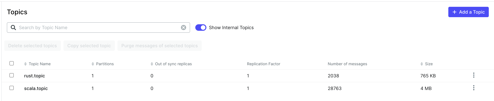

# Publishing Olympics Benchmarks (totally not AI-generated)




Why is my Rust not blazing fast? 🙁


This project benchmarks Rust and Scala Kafka producers using Docker Compose and a Python script.

## Prerequisites

- Docker & Docker Compose
- Python 3.8+
- [uv](https://github.com/astral-sh/uv)
- Rust toolchain (`cargo`)
- Scala & SBT

## Setup

1. **Start Kafka and Zookeeper:**

   ```sh
   docker compose up -d
   ```

2. **Prepare Python environment:**
   With `uv` (recommended):

     ```sh
     uv venv .venv
     source .venv/bin/activate
     uv pip install psutil

3. **Run the benchmark:**

   ```sh
   python benchmarks.py
   ```

The script will:

- Build the Rust and Scala producers
- Run each producer for a fixed duration
- Count messages in Kafka topics
- Print a summary

## Stopping Services

To stop Kafka and Zookeeper:

```sh
docker compose down
```

---
For troubleshooting, check Docker logs or ensure all dependencies are installed.
